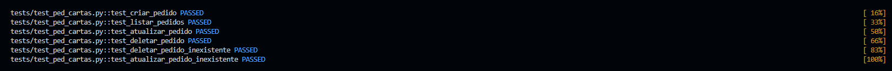

# API de Pedidos de Cartas de Magic


---

## Iniciar Programa

```bash
docker-compose up -d
```

## Executar os testes

```bash
pytest -v
```

## Executando servidor local 
```bash
uvicorn main:app --reload
```
---

## Saída esperada



---

## Tecnologias e Ferramentas

```text
- Python 3.12
- FastAPI (Framework web de alta performance para construção da API)
- MongoDB (Banco de dados NoSQL para persistência dos pedidos)
- RabbitMQ (Sistema de mensageria para comunicação assíncrona)
- Apache Kafka (Plataforma de streaming de eventos para integração entre sistemas)
- Docker & Docker Compose (Conteinerização e orquestração dos serviços)
- Pytest (Framework para testes automatizados)
- Pydantic (Validação e serialização de dados)
- PyMongo (Driver oficial para integração com o MongoDB)

```
